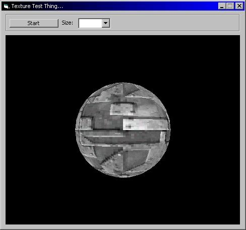



## A 3D Texturing/Animation Example

### Description

Gears toward teaching you how to texture, add light, rotate, set spin animation, and basicly use DirectX's RMControl (ocx included, read the text document). Every line of code is commented with an Easy to understand sence and description. Great to learn off! Please Vote!!!
 
### More Info
 

             |
---                |---
**Submitted On**   |2002-02-06 23:26:58
**By**             |[SOLID4K TEAM](https://github.com/Planet-Source-Code/PSCIndex/blob/master/ByAuthor/solid4k-team.md)
**Level**          |Intermediate
**User Rating**    |4.0 (16 globes from 4 users)
**Compatibility**  |VB 4\.0 \(32\-bit\), VB 5\.0, VB 6\.0
**Category**       |[DirectX](https://github.com/Planet-Source-Code/PSCIndex/blob/master/ByCategory/directx__1-44.md)
**World**          |[Visual Basic](https://github.com/Planet-Source-Code/PSCIndex/blob/master/ByWorld/visual-basic.md)
**Archive File**   |[A\_3D\_Textu53562272002\.zip](https://github.com/Planet-Source-Code/solid4k-team-a-3d-texturing-animation-example__1-31567/archive/master.zip)

